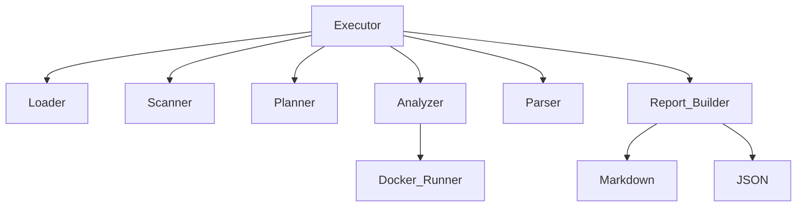

# Analysis Engine: Technical Design & Architecture Review (v1-detailed)

**Author:** Principal Enterprise Solutions Architect
**Status:** Evaluation vs. Vision (Release Candidate v1.0 -> v2.0 Platform)

---

## 1. Project Overview
The Analysis Engine is a static analysis orchestration ("organizing and coordinating many different parts so they work together smoothly to reach a goal") framework designed to abstract away the complexity of configuring and running disparate SAST and quality tools. It provides a zero-install, single-command entry point to clone a repository, detect its languages, dynamically map required analyzers, execute them in isolated Docker containers, and aggregate the disparate XML/JSON outputs into a unified Markdown/JSON report.

## 2. Original Objective of the Project
The initial objective was simply to build a script to automate the execution of SonarQube, Cppcheck, and Arduino CLI across multiple codebases without forcing developers to install native binaries or struggle with environmental path configurations.

## 3. Current State of the Project
The project has successfully achieved v1.0 status. It is a highly decoupled, modular pipeline capable of reliable repository synchronization, mathematical deduplication of execution tasks, and perfectly isolated Docker orchestration with robust error interception. It currently excels as a static analysis CLI wrapper. 

However, evaluating it against the ambitious vision of an **Intelligent Universal Repository Analysis Platform**, the current state is merely the foundational orchestration layer. It lacks repository intelligence, scope flexibility, cross-tool correlation, and AI enrichment.

---

## 4. Overall Architecture
The system employs a strict **Layered Pipeline Architecture**. Data flows purely sequentially in one direction:
`Input -> Loader -> Scanner -> Planner -> Executor (Docker) -> Parser -> Aggregator -> Report`.
The core philosophy is passing immutable dataclasses across layer boundaries, ensuring that failures in one domain (e.g., Cppcheck Parsing) cannot poison the state of another domain (e.g., SonarQube Execution).

## 5. Folder Structure
* `analyzers/`: Contains tool-specific integration layers. Maps engine tasks to raw Docker commands.
* `config/`: Holds `config.yaml` and strongly-typed hydration classes.
* `engine/`: The `executor.py` orchestrator that glues the pipeline together.
* `parsers/`: Translates arbitrary vendor output strings (XML/JSON) into internal `Issue` models.
* `planner/`: The decision engine. Maps detected languages to tools and mathematically deduplicates them.
* `reports/`: The presentation layer. Flattens data and outputs Markdown/JSON.
* `repository/`: Git/Local file I/O operations and validation.
* `scanner/`: Analyzes the codebase topology to feed metadata to the planner.
* `tests/`: Isolated Pytest fixtures validating pipeline components.
* `utils/`: Cross-cutting helpers (OS-agnostic subprocess execution, stdout logging).
* `workspace/`: The dynamically managed sandbox for code and raw results.

## 6. File Structure
* **`main.py`**: CLI entry point. Exposes `argparse`.
* **`config/settings.py`**: Hydrates YAML into `@dataclass AppConfig`. Protects against runtime configuration typos.
* **`repository/manager.py`**: A Facade routing to the correct loader based on the `RepositoryType` enum.
* **`repository/loaders/local_loader.py`**: Safely synchronizes local directories into the workspace, aggressively clearing stale caches using `shutil.rmtree`.
* **`scanner/repository_scanner.py`**: Executes a Depth-First Search over the codebase to yield file counts and types.
* **`planner/planner.py`**: The core business logic generating the `AnalysisPlan`.
* **`planner/rules.py`**: The declarative mapping configuration linking "Python" to "SonarQube".
* **`analyzers/sonar_scanner.py`**: Integrates SonarQube. Crucially, implements an HTTP `while` loop to paginate through the SonarQube Web API, preventing the silent truncation of issues over 100.
* **`parsers/cppcheck_parser.py`**: Unmarshals Cppcheck XML using `xml.etree.ElementTree`.
* **`reports/report_builder.py`**: Flattens `ParseResult` objects into the unified `Report`.
* **`utils/docker_runner.py`**: Highly defensive OS boundary layer. Executes Docker commands using Python lists to entirely bypass shell string escaping vulnerabilities.

---

## 7. Complete Execution Flow
1. `main.py` is called with `--source` and `--type`.
2. `engine.executor.run()` invokes `manager.load_repository()`.
3. The Loader wipes the stale cache in `workspace/repositories/repo` and copies fresh code.
4. `repository_scanner.scan()` walks the code, yielding a `RepositoryIndex` (e.g., Python: 10 files).
5. `planner.create_plan()` maps languages to tools and yields a deduplicated `AnalysisPlan`.
6. For each task, `executor.py` looks up the Analyzer.
7. `analyzers/<tool>.py` validates `docker_image` config, skipping gracefully if empty.
8. `utils.docker_runner` mounts `/workspace/repo:/src` and runs the container.
9. Raw XML/JSON is dumped into `/workspace/raw-results/`.
10. `executor.py` looks up the corresponding Parser.
11. `parsers/<tool>.py` maps raw text into a `list[Issue]`.
12. `report_builder.build()` aggregates all issues.
13. `json_report` and `markdown_report` generate the final artifacts.

## 8. Module Dependency Diagram


---

## 9. Technology Stack
* **Language**: Python 3.10+ (Type-hinted strictly)
* **Execution Boundary**: Docker Engine / WSL2
* **Testing**: Pytest (Extensive use of `unittest.mock.patch`)
* **Core Analyzers**: SonarQube Scanner CLI, Cppcheck CLI, Arduino CLI

## 10. Docker Architecture
The system leverages Docker to solve the "Works on My Machine" problem. It mounts the `workspace/` via `-v` volume flags. It utilizes Python lists `["docker", "run", "-v", "C:\path:/src"]` passed to `subprocess.run(shell=False)` to delegate quote-wrapping directly to the underlying OS API (`CreateProcess` on Windows). It also bridges container isolation gaps by passing `-e SONAR_HOST_URL=http://host.docker.internal:9000` to allow containers to access host-bound services.

## 11. Configuration System
The `config/config.yaml` exposes highly volatile endpoints (URL, tokens, FQBN, Docker images). `config/settings.py` strictly hydrates this using `pyyaml` into an immutable `AppConfig` dataclass. If an analyzer image is empty (e.g., `""`), the pipeline detects this and gracefully skips the tool instead of crashing.

---

## 12. Analyzer Pipeline
Isolated implementations of `AbstractAnalyzer`. Each is responsible for building its own CLI arguments and interpreting its own success/fail exit codes.
## 13. Repository Loading Pipeline
An abstract interface enforcing idempotency. All loaders must guarantee that `load()` returns the absolute latest code representation, regardless of previous cached runs.
## 14. Scanner Pipeline
Currently a synchronous Depth-First Search (`Path.iterdir()`). It skips configured ignored directories (`.git`, `node_modules`).
## 15. Planner Logic
Converts `LanguageInfo` to `AnalyzerType`. Implements mathematical deduplication using a `set()`. 
## 16. Tool Selection Logic
A deterministic, declarative mapping defined in `tool_mapper.py` and `rules.py`.
## 17. Parser Architecture
**Simple Explanation:** Think of the Parser as a universal translator. Every tool speaks a different language (Cppcheck outputs XML, SonarQube outputs JSON, Arduino outputs plain text). The parser reads these messy, disparate formats and translates them into a single, standardized `Issue` format that the rest of the engine can understand.

**Technical Details:** Isolated translation scripts (`AbstractParser`). Designed to intercept malformed XML/JSON safely, marking `parse_successful = False` without crashing the global loop.
## 18. Report Generation Pipeline
Takes the `Report` dataclass and pushes it through format-specific generators.

---

## 19. JSON Report Structure
```json
{
  "repository_name": "repo",
  "total_issues": 1,
  "tool_results": [
    {
      "tool": "SONARQUBE",
      "issues": [{"severity": "MAJOR", "file": "main.py", "rule": "python:S123"}]
    }
  ]
}
```

## 20. Markdown Report Structure
Features an Executive Summary, Global Issue Count, and tabular breakdowns of issues grouped by Tool -> Severity -> File -> Rule.

---

## 21. Testing Architecture
17-test suite. Covers YAML hydration, planner deduplication, local loader sync caching, Docker execution mocking (using `@patch`), failure fallback handling, and parser translation using static JSON/XML fixtures.
## 22. Logging Architecture
Standardized `logging` module outputting to console and `logs/`. Differentiates DEBUG (Docker stdout) from INFO (Pipeline transitions).
## 23. Error Handling Strategy
Exceptions are tightly scoped. A failed XML parse in Cppcheck results in `ParseError`, which the executor catches, marks the tool result as failed, appends the error string, and continues parsing the remaining tools.

---

## 24. Current Features Implemented
* Dynamic Deduplicated Orchestration
* Local Folder / Git HTTPS / Git SSH Loading
* Zero-Install Docker Execution
* SonarQube API Pagination Mitigation
* Windows PowerShell Path Escaping Compatibility
* Unified Markdown/JSON reporting

## 25. Features Partially Implemented
* Arduino CLI Analysis (Lacks recursive `.ino` discovery, assumes single root sketch).
* Cppcheck Analysis (Acts repository-wide, but is planned as language-specific).

## 26. Features Missing
* ZIP file loading.
* Intelligence Engine (Framework/Dependency detection).
* Scope-based execution (Folder/File level analysis).
* Parallel task execution.
* Cross-tool issue deduplication.
* AI LLM Integration.
* Web Dashboard.

---

## 27. Current Limitations
* Executes tasks sequentially.
* Scanner blocks on synchronous I/O.
* Analyzes the entire repository root unconditionally.

## 28. Known Bugs
* `sonar_parser.py` maps missing `textRange` (line numbers) to `None`, which may violate strict typing downstream if not handled defensively.
* Arduino CLI scanner fails if multiple `.ino` sketches exist in nested subdirectories.

---

## 29. Performance Analysis
The sequential execution model is the biggest bottleneck. If a repository triggers 5 Docker analyzers taking 2 minutes each, the total run time is 10 minutes. 

## 30. Scalability Analysis
Scanning massive monorepos (>500k files) using a single-threaded Python `while` loop calling OS-level `stat()` will introduce immense latency. The system must migrate to parallel scanning and execution.

## 31. Security Review
* High safety profile via `subprocess.run` passing arguments as lists, mitigating command injection entirely.
* Tokens are externalized to YAML.
* Repository fetching uses standard Git SSH keys.

## 32. Code Quality Review
Exceptional. Heavy use of `@dataclass`, strict `type hints`, highly decoupled interfaces, and DRY logic.

## 33. Architectural Strengths
The pipeline is virtually indestructible. Because data boundaries are simple dataclasses, one layer's failure cannot halt the system. Adding new tools is mathematically trivial.

## 34. Architectural Weaknesses
Sequential iteration constraints. The Planner lacks visibility into non-language metadata (like frameworks and folder structures). The `AnalyzerType` enum violates the Open/Closed Principle for third-party extensions.

## 35. SOLID Principles Review
* **Single Responsibility**: Excellent (Every file does exactly one thing).
* **Open/Closed**: Needs Improvement (Requires modifying the core enum to add tools).
* **Liskov Substitution**: Excellent (Interfaces strictly adhered to).
* **Interface Segregation**: Excellent.
* **Dependency Inversion**: Excellent (Core executor relies purely on abstractions).

---

## 36. Enterprise Readiness Assessment
Not ready. It lacks the Web UI, API layer, historical tracking, and AI enrichment expected by enterprise teams.

## 37. Production Readiness Assessment
**Ready for Internal Beta (Release Candidate 1).** The engine is incredibly stable for analyzing individual repositories synchronously, but is not yet a scaled platform.

---

## 38. Recommendations for Version 1.5
* Build the `intelligence_engine.py` to parse `requirements.txt` and `package.json` for frameworks.
* Implement `--scope` CLI flags to pass subdirectories to Docker rather than `/src`.
* Fix Arduino recursive sketch discovery.

## 39. Recommendations for Version 2.0
* Implement `concurrent.futures.ThreadPoolExecutor` for parallel Docker execution.
* Build the `Deduplicator` module to merge redundant Sonar/Cppcheck issues.
* Replace the `AnalyzerType` enum with a dynamic `plugins/` registry.

## 40. Recommendations for Version 3.0
* Wrap the engine in FastAPI with a PostgreSQL database.
* Hook an LLM API to the report generator for AI Executive Summaries and refactoring tips.
* Build the React/Next.js dashboard.

---

## 41. Gap Analysis: Current vs. Long-Term Vision

The vision is an **Intelligent Universal Repository Analysis Platform**.
Currently, it is a **Static Analysis Orchestration CLI**.

The Gap:
1. **Repository Intelligence**: The engine treats all Python files equally. The vision requires knowing if the Python file is a Flask Route or a Data Science notebook.
2. **Analysis Resolution**: The engine scans globally. The vision requires surgical precision (File/Sprint level).
3. **Report Intelligence**: The engine outputs raw vulnerability lists. The vision requires correlating Cppcheck/Sonar overlapping issues and explaining them via AI.
4. **Accessibility**: The engine runs in the terminal. The vision requires an interactive Web Dashboard tracking trends over time.

---

## 42. Feature Completion Matrix vs. Vision

| Core Requirement | Status | Score |
| :--- | :--- | :--- |
| Universal Repo Loading | mostly achieved | 90% |
| Multi-tool Orchestration | achieved | 100% |
| Docker Isolation | achieved | 100% |
| Mathematical Deduplication | achieved | 100% |
| Unified Reporting | achieved | 100% |
| Framework/Dependency Detection | missing | 0% |
| Architecture Topology Detection | missing | 0% |
| Scope-based Analysis (Sprint/File) | missing | 0% |
| Cross-tool Issue Deduplication | missing | 0% |
| AI Summaries & Explanations | missing | 0% |
| Web UI & Trend Tracking | missing | 0% |
| Parallel Execution | missing | 0% |

**Overall Estimated Completion toward Ultimate Vision**: **35%**

---

## 43. Implementation Roadmap & Action Plan

**Phase 1: Intelligence (The Immediate Next Step)**
1. Create `scanner/intelligence_engine.py`.
2. Add regex parsers for `requirements.txt`, `package.json`, `pom.xml`.
3. Update `RepositoryIndex` to hold `frameworks: list[str]` and `dependencies: list[str]`.
4. Refactor `arduino_scanner.py` to recursively compile every `.ino` found.

**Phase 2: Scoping & Parallelism**
1. Add `AnalysisScope` dataclass. Update Planner and Executor to pass target subdirectory paths directly to Docker volumes.
2. Implement ThreadPooling in `executor.py` for concurrent execution.

**Phase 3: Correlation & AI**
1. Add `reports/deduplicator.py` to merge identical issues based on File + Line matching.
2. Add `ai_engine/assistant.py` to generate rich LLM text blocks from the flattened JSON report.

**Phase 4: The Enterprise Platform**
1. Port CLI to FastAPI.
2. Build React Web Interface.
3. Establish SQLite/PostgreSQL Database for history tracking.
